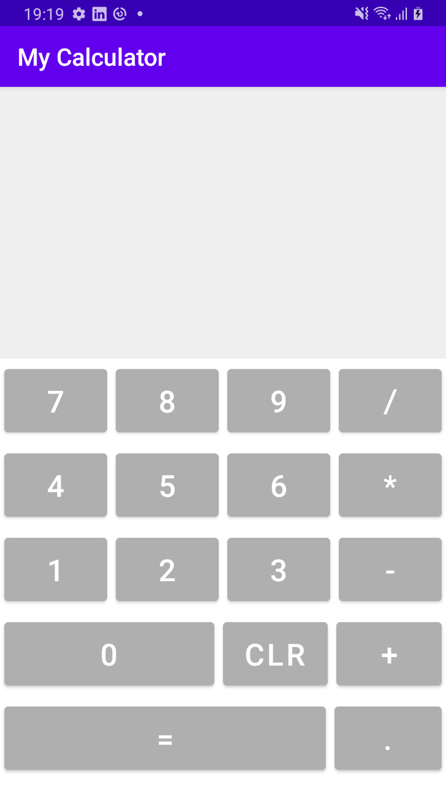

# calculator-app

My "Calculator" app from Udemy course "The Complete Android 12 &amp; Kotlin Development Masterclass".

I've coded the app herein in Kotlin. It receives an arithmetic expression as an input, solves it, and then outputs the result.

This exercise approaches mainly the following concepts:

- [X] Nested layouts; and
- [X] Layout weights.

The following limitations apply: 

- The calculator itself is limited to basic arithmetic operations;
- Floating point results are bound to 6 decimals; and
- No granular expression validity checks are available. 
